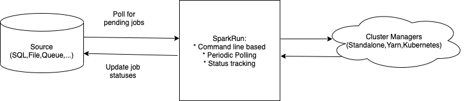

# HSPARKRUN

### HSparkRun is an ongoing project with two objectives: 
##### 1. A comparative study with another Scala / Cats project https://github.com/sumawa/sa-spark-run/
##### 2. Exploring IO/Concurrency/Streaming/Persistent and other libraries  
##### 3. A utility project (Spark Job Execution and tracking)

Docs here: <link href="https://htmlpreview.github.io/?https://github.com/sumawa/hspark-run/blob/master/docs/index.html target="_blank"> 

It is a mirror project of Scala / Cats based project doing the same things.
https://github.com/sumawa/sa-spark-run/

### HSparkRun is an ongoing project with two objectives: 
* Spark Job Execution and Tracking Service
* launched via command line
* has two components (Runner for submitting jobs and Tracker for tracking jobs)

### HSparkRun Spark Execution and Tracking Service

### Concepts explored

#### Major themes explored in this project
* IO Monad
* Persistent library for Postgres and others, peristent-template for Template Haskell
* Monad Transformers (MaybeT,ExceptT,ReaderT,StateT, etc)
* Aeson, aeson-lens,lens for parsing
* wreq for HTTP client
* concurrency and async
* Testing via HSpec

#### Major themes pending
* Proper concurrency strategies
* Conduit based streaming and throttling
* QuickCheck with load testing
* How to create a haskell library
* Proper implementation of Algebraic Data Types and assoicated algebra

### HSparkRun Design Goals

1. Launch via command line
2. Configurable Multi Cluster Manager Yarn/Standalone/Kubernetes support
3. A "Job" is one unit of spark execution, representing a spark job.
5. There are two services "SparkRunner" and "Tracker"
4. Configurable poll based Multi Job Source (SQL DB, FileSystem, Message Queues, others ...)
5. SparkRunner service detects pending jobs and submits in parallel via Spark Runner (or executor service)
7. Tracker tracks multiple pending jobs 

### How to run
1. Pending

### Configuration Guide
1. Pending (link to separate document covering YARN / Standalone configuration elements in detail.)

### Upcoming enhancements

1. Kerberos support
2. Yarn / Hadoop support
3. Kubernetes, Rabbit MQ, Kafka support
4. Use dockerized containers for integration testing.
5. Integrate with JIRA
6. Exhaustive test coverage.

	
